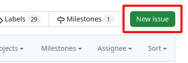
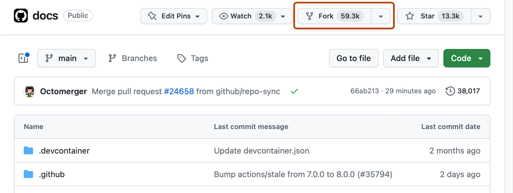
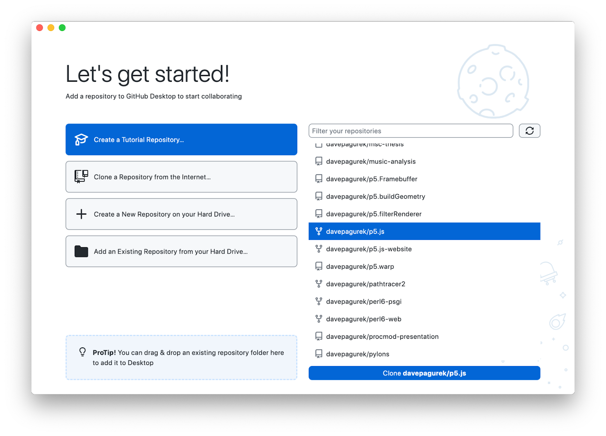
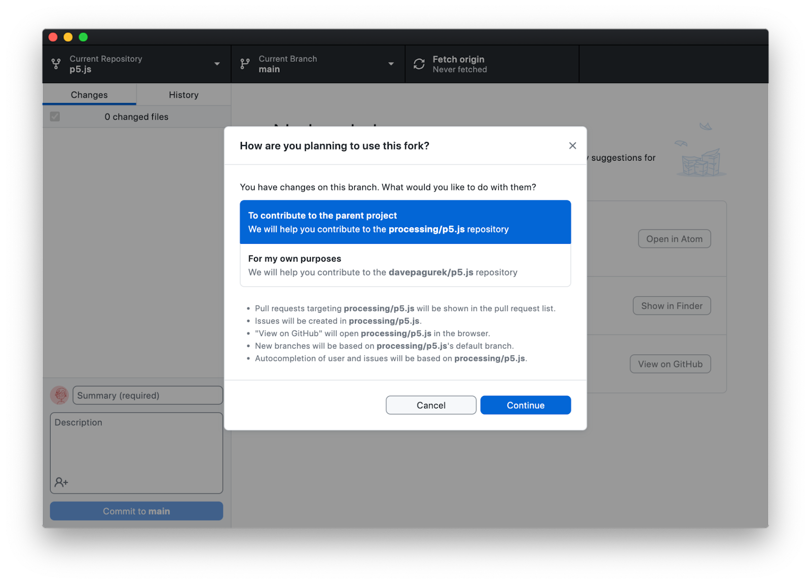

# Instrucciones para colaboradores

¡Bienvenidos! Este documento está diseñado para ayudar a nuevos contribuidores que deseen aportar código a la biblioteca de p5.js, así como a aquellos que busquen refrescar sus conocimientos sobre procedimientos técnicos. También es útil para cualquier persona interesada en realizar cualquier tipo de contribución al código de p5.js.

Si estás buscando contribuir más allá de los repositorios de p5.js (escribiendo tutoriales, planeando clases, organizando eventos), por favor dirígete a la documentación correspondiente para este tipo de colaboraciones. Aquellos que sean Supervisores o Responsables de mantenimiento, encontrarán más útil referirse a las [Instrucciones para Supervisores](https://github.com/processing/p5.js/blob/main/contributor_docs/steward_guidelines.md) cuando se trata de revisar 'Issues' (problemas) y 'Pull Requests'. 

Este es un documento relativamente largo pero comprensible, y trataremos de indicar todos los pasos tan claro como sea posible. Sin embargo, utiliza la tabla de contenidos para encontrar las secciones que son relevantes para ti, y siéntete libre de omitir secciones que no son relevantes para las contribuciones que planeas hacer. 

**Si eres un nuevo contribuidor te sugerimos comenzar con la primera sección: “ Todo acerca de los Issues (o problemas)”.  Por el contrario, si simplemente quieres un paso-a-paso del la configuración del  proceso de desarrollo, puedes dirigirte a la sección  de “Inicio Rápido para Desarrolladores”.**


# Tabla de Contenidos

- [Todo acerca de los 'Issues' o problemas](#all-about-issues)
  - [¿Qué son los 'Issues' en GitHub?](#what-are-issues)
  - [Plantillas para reportar 'Issues'](#issue-templates)
    - [Reportar un error](#found-a-bug)
    - [Sugerir una mejora a una funcionalidad existente](#existing-feature-enhancement)
    - [Sugerir una funcionalidad nueva](#new-feature-request)
    - [Abrir una discusión ](#discussion)
- [Trabajando en la base de código de p5.js](#working-on-the-p5js-codebase)
  - [Inicio Rápido para Desarrolladores](#quick-get-started-for-developers)
  - [Utilizando la funcionalidad de edición de Github](#using-the-github-edit-functionality)
  - [Haciendo un fork de p5.js y trabajando desde tu fork](#forking-p5js-and-working-from-your-fork)
    - [Utilizando Github Desktop](#using-github-desktop)
    - [Utilizando la interfaz de línea de comandos de Git](#using-the-git-command-line-interface)
  - [Desglose de la base de código ](#codebase-breakdown)
  - [Configuración de compilación](#build-setup)
  - [Flujo de trabajo de Git](#git-workflow)
    - [Código fuente](#source-code)
    - [Pruebas unitarias](#unit-tests)
    - [Documentación en línea](#inline-documentation)
    - [Internacionalización](https://github.com/processing/p5.js/blob/main/contributor_docs/contributor_guidelines.md#internationalization)
    - [Accesibilidad](#accessibility)
  - [Estándares de código](#code-standard)
  - [Principios de Diseño de Software](#software-design-principles)
- [Pull Requests](#pull-requests)
  - [Creación de un Pull Request](#creating-a-pull-request)
    - [Información sobre el Pull Request](#pull-request-information)
    - [Titulo](#title)
    - [Resuelve ](#resolves)
    - [Cambios](#changes)
    - [Captura de pantalla de los cambios](#screenshots-of-the-change)
    - [Lista de verificación del Pull Request](#pr-checklist)
    - [Rebase y resolución de conflictos](#rebase-and-resolve-conflicts)
  - [Discutir y Corregir](#discuss-and-amend)

---
# Todo acerca de los “Issues” o problemas

La mayoría de la actividad en los repositorios de GitHub de p5.js (también conocidos como "repo" de forma abreviada) ocurre en los 'Issues', o problemas, lo cual es un excelente lugar para comenzar tu viaje de contribución.


## ¿Qué son los ‘Issues’ en GitHub?


<em>'Issues'</em> es el nombre común que se le da a una publicación en GitHub que apunta a describir, como lo dice su nombre, un problema.  Los <em>Issues</em> pueden ser reportes de error, solicitudes para añadir un nueva funcionalidad, una discusión, o cualquier publicación que se relacione con el desarrollo de la biblioteca de p5.js. Cualquiera con una cuenta de GitHub puede añadir comentarios debajo de cada <em>Issue</em>, ¡incluyendo bots! Éste es el lugar donde los contribuidores discuten temas relacionados con el desarrollo del proyecto dentro del repositorio.

Mientras un <em>Issue</em> puede ser creado por diferentes razones, usualmente utilizamos la creación de un <em>Issue</em> para discutir el desarrollo del  código fuente de p5.js. Temas como la corrección de errores de tu propio código, invitación de colaboradores a tu proyecto, u otros temas no relacionados, deben ser discutidos ya sea en el [fórum](https://discourse.processing.com) o en otras plataformas de comunicación como [Discord](https://discord.gg/SHQ8dH25r9).

¡Hemos creado plantillas fáciles de usar que puede ayudarte a determinar si un tema es adecuado para ser publicado como un <em>Issue</em> en GitHub, o si sería más apropiado publicarlo en otro lugar!


## Plantillas para reportar <em>Issues </em>
Las plantillas  para reportar <em>Issues</em> en p5.js hacen que sea más sencillo para los Supervisores y los responsables de mantenimiento entender y revisar el contenido sugerido por el colaborador. Además, las plantillas le facilitan al colaborador el proceso de completar un <em>Issue</em>  y, así mismo, le permiten recibir una respuesta más rápida. 


Para registrar un <em>Issue</em> por primera vez dentro del repositorio de p5.js, haz click en la  pestaña que dice "Issues", ubicada en la parte superior. Una vez dentro de la página de "Issues"  haz clic en el botón <em>"New Issue"</em> (problema nuevo), que se encuentra al costado derecho. Se te presentarán diferentes opciones de plantilla que te van a dirigir al lugar adecuado para registrar tu <em>Issue</em>. Te recomendamos elegir la plantilla más relevante para tu caso para asegurarte de que tu <em>Issue</em> reciba rápidamente la atención correcta.



### ["Reportar un Error"](https://github.com/processing/p5.js/issues/new?assignees=\&labels=Bug\&projects=\&template=found-a-bug.yml)

Cuando encuentres un comportamiento incorrecto en p5.js, o algo que no se esté comportando como se ha descrito en la documentación, [usa esta plantilla]( https://github.com/processing/p5.js/issues/new?assignees=&labels=Bug&projects=&template=found-a-bug.yml). Por favor, ten en cuenta que si estás  tratado de corregir el código de tu sketch, y crees que el problema tal vez se encuentra en tu código, primero consulta en el [foro de discusiones]( https://discourse.processing.org/) antes de reportar un error.

Esta plantilla provee campos que debes llenar con la siguiente información relevante: 

1.	**¿Cuál es la subárea más adecuada de p5.js?:** esto añadirá automáticamente las [etiquetas]( https://github.com/processing/p5.js/blob/main/contributor_docs/issue_labels.md) relevantes a tu <em>Issue</em>, lo que nos ayudará a identificar y responder adecuadamente.
2.	**Versión de p5.js:** puedes verificar la versión de p5.js dentro de la etiqueta `<script>`  que se encuentra en la primera línea del archivo p5.js/p5.min.js. 
3.	**Navegadores web y versión de los mismos:** esta sección nos ayuda a identificar diversos comportamientos entre los diferentes navegadores web. Para encontrar la versión de tu navegador, sigue las instrucciones proporcionadas en la tabla siguiente según el navegador que estés utilizando.

<table>

<tr>

<td>

Chrome

</td>

<td>

Firefox

</td>

<td>

Safari

</td>

</tr>

<tr>

<td>

Abre una ventana del navegador y en la barra de direcciones, navega a  `chrome://version`

</td>

<td>

Abre una ventana del navegador, y en la barra de direcciones navega a   `about:support`

</td>

<td>

Abre una venta del navegador y, en el menú superior, haz clic sobre "Safari", te aparecerá un desplegable con diferentes opciones, deberás seleccionar "Sobre Safari".

</td>

</tr>

</table>

4.	**Sistema Operativo:** En lo posible,  incluye la versión del Sistema Operativo, por ejemplo, `macOS 12.5`. Algunos errores se pueden derivar de comportamientos del sistema operativo.
5.	**Pasos para reproducir el error:** Esta es una de la piezas de información más importantes. Comparte una lista de pasos detallados con los cuales podemos replicar el error que has encontrado. Compartir una muestra de código que exponga el problema puede ser de gran ayuda para cualquiera que busque replicar el error que estás enfrentando, y comenzar a formular una solución.

**¡La replicación es clave!** La gran mayoría de los campos en esta plantilla tienen como objetivo replicar el error. Entre más información proveas acerca de tu sketch y como otros pueden replicar el error que has encontrado, más fácil será para la comunidad ayudarte a buscar una solución.

**Sé lo más detallado posible y evita las afirmaciones genéricas**, por ejemplo, no digas "la función `image()` no funciona", sino sé más específico, como "la función `image()` no muestra la imagen GIF cargada en el tamaño correcto". Una forma útil de describir el error que estás enfrentando es describir dos cosas:

1.	¿Qué es lo que esperas del código que has compartido? (comportamiento esperado).
2.	¿Qué es lo que está haciendo el código que has compartido? (comportamiento presente).

Si deseas contribuir a la solución del error que has reportado, indícalo en la descripción. Puedes proveer sugerencias sobre cómo el error que has descrito puede ser corregido. Esta descripción nos ayudará a saber cuánto apoyo necesitas para contribuir a la solución del error.

**No debes registrar un <em>Pull Request</em> ni comenzar a trabajar en cambios de código sin antes haber registrado un <em>Issue</em> correspondiente, o antes de que dicho <em>Issue</em> haya sido aprobado para su implementación**. Esto se debe a que la solución propuesta podría no ser aceptada, podría requerir un enfoque completamente diferente o es posible que el problema real esté en otro lugar. Cualquier <em>Pull Request</em> que se registre antes de que se haya aprobado un <em>Issue</em> correspondiente será cerrado hasta que el <em>Issue</em> haya sido aprobado previamente.

Para que un reporte de error sea aceptado para su corrección, este debe ser aprobado por al menos un [supervisor de área o responsable de mantenimiento]( https://github.com/processing/p5.js#stewards), antes de que se pueda comenzar a trabajar en el <em>Pull Request</em>.

### [Sugerir una mejora a una funcionalidad existente](https://github.com/processing/p5.js/issues/new?assignees=\&labels=Enhancement\&projects=\&template=existing-feature-enhancement.yml)

Esta plantilla debe ser usada si deseas proponer cambios o sugerir mejoras a una funcionalidad existente en p5.js (funciones, constantes, renderización, etc ). Por ejemplo, si quisieras proponer una nueva manera de definir un color con la función `color()` u otras funciones que acepten colores, esta sería la plantilla a utilizar. 

Esta plantilla provee campos que debes llenar con la siguiente información relevante: 

1.	**Incrementar Accesibilidad:**  Este es un campo requerido en el cual debes explicar cómo la adición de la mejora o cambio a la funcionalidad existente, ayudará a [incrementar accesibilidad]( https://github.com/processing/p5.js/blob/main/contributor_docs/access.md) para las personas que han sido históricamente marginadas en las disciplinas de las artes y las tecnologías. **Ninguna propuesta será aceptada sin esta declaración**. Sin embargo, puedes añadir "No estoy seguro" a este campo, y comenzar una conversación con la comunidad para entender como tu propuesta puede abordar el tema de accesibilidad en p5.js.

2.	**¿Cuál es la subárea más adecuada de p5.js?:** Esto añadirá automáticamente las [etiquetas]( https://github.com/processing/p5.js/blob/main/contributor_docs/issue_labels.md) relevantes a tu <em>Issue</em>, lo que nos ayudará a identificar y responder adecuadamente.

3.	**Detalles de mejora de funcionalidades:** Aquí debes describir tu propuesta para la mejora de funcionalidad(es). Una buena propuesta generalmente incluye un caso de uso específico: qué, cuándo, cómo y por qué esta funcionalidad es necesaria.

Para que las propuestas de mejora de funcionalidad(es) sean aceptadas, estas deben ser aprobadas por al menos un [supervisor de área o responsable de mantenimiento]( https://github.com/processing/p5.js#stewards), antes de que se comience a trabajar en el <em>Pull Request</em>.

**No debes registrar un <em>Pull Request</em> ni comenzar a trabajar en cambios de código sin antes haber registrado un <em>Issue</em> correspondiente, o antes de que dicho <em>Issue</em> haya sido aprobado para su implementación**. Esto se debe a que no hay garantía de que la propuesta será aceptada. Cualquier <em>Pull Request</em> que se registre antes de que se haya aprobado un <em>Issue</em> correspondiente será cerrado hasta que el <em>Issue</em> haya sido aprobado previamente.

### ["Sugerir una funcionalidad nueva"](https://github.com/processing/p5.js/issues/new?assignees=\&labels=Feature+Request\&projects=\&template=feature-request.yml)

Esta plantilla debe ser usada si deseas proponer la adición de una nueva funcionalidad a p5.js. Por ejemplo, imagina que quieres añadir soporte para dibujar elementos `<table>`, propios de HTML, con una nueva función que se llame `createTable`. Si tu propuesta se superpone con otras propuestas de mejora existentes, te sugerimos que evalúes y elijas la plantilla que consideres más apropiada para tu caso (ya sea funcionalidad existente o funcionalidad nueva)

Esta plantilla provee campos que debes llenar con la siguiente información relevante: 
1.	**Incrementar Accesibilidad:**  Este es un campo requerido en el cual debes explicar cómo la adición de la mejora o cambio a la funcionalidad existente, ayudará a [incrementar accesibilidad]( https://github.com/processing/p5.js/blob/main/contributor_docs/access.md) para las personas que han sido históricamente marginadas en las disciplinas de las artes y las tecnologías. **Ninguna propuesta será aceptada sin esta declaración**. Sin embargo, puedes añadir "No estoy seguro" a este campo, y comenzar una conversación con la comunidad para entender como tu propuesta puede abordar el tema de accesibilidad en p5.js.

2.	**¿Cuál es la subárea más adecuada de p5.js?:** Esto añadirá automáticamente las [etiquetas]( https://github.com/processing/p5.js/blob/main/contributor_docs/issue_labels.md) relevantes a tu <em>Issue</em>, lo que nos ayudará a identificar y responder adecuadamente.

3.	**Detalles de la nueva funcionalidad:** Aquí debes describir tu propuesta para proponer la adición de una nueva funcionalidad. Una buena propuesta generalmente incluye un caso de uso específico: qué, cuándo, cómo y por qué esta funcionalidad es necesaria.

Para que una nueva funcionalidad sea aceptada, esta debe ser aprobada por al menos 2 [supervisores de área o responsables de mantenimiento]( https://github.com/processing/p5.js#stewards), antes de que se comience a trabajar en el <em>Pull Request</em>.

**No debes registrar un <em>Pull Request</em> ni comenzar a trabajar en cambios de código sin antes haber registrado un <em>Issue</em> correspondiente, o antes de que dicho <em>Issue</em> haya sido aprobado para su implementación**. Esto se debe a que no hay garantía de que la propuesta será aceptada. Cualquier <em>Pull Request</em> que se registre antes de que se haya aprobado un <em>Issue</em> correspondiente será cerrado hasta que el <em>Issue</em> haya sido aprobado previamente.


### [Abrir una discusión](https://github.com/processing/p5.js/issues/new?assignees=\&labels=Discussion\&projects=\&template=discussion.yml)

Esta plantilla se utiliza cuando el <em>Issue</em> que estas registrando no encaja en ninguna de las plantillas anteriores. Un <em>Issue</em> que no corresponda a ninguna de las plantillas proporcionadas es relativamente inusual. Por ejemplo, si hay una discusión sobre si se debe adoptar una funcionalidad de una API web específica en p5.js, esta debería registrarse como ['Sugerir una funcionalidad nueva]( https://github.com/processing/p5.js/blob/main/contributor_docs/contributor_guidelines.md#new-feature-request). En otro ejemplo, una discusión acerca de añadir nuevos modos de colores a las funciones de color de p5.js, debe ser registrada como [“Sugerir una mejora a una funcionalidad existente”]( https://github.com/processing/p5.js/blob/main/contributor_docs/contributor_guidelines.md#existing-feature-enchancement). Finalmente, si tienes un anuncio sobre un evento local de programación que estás  organizando, este debería ser publicado en el foro e inclusive podrías contactar a la Fundación de Processing si estás buscando apoyo, publicidad, etc.

Al abrir una discusión, puedes utilizar el panel de “Etiquetas”, que encontraras al costado derecho, para agregar etiquetas relevantes y así dirigir tu ‘Issue’ al área correspondiente. La plantilla en sí, consiste en un campo abierto que te permite comenzar una discusión. Puedes encontrar [aquí]( https://github.com/processing/p5.js/issues/6517) un ejemplo de una discusión.

[**⬆ Volver arriba.**](#contributor-guidelines)

---

# Trabajando en la base de código de p5.js

## Pre-requisitos

Para proceder, debes tener un conocimiento mínimo sobre cómo trabajar con la línea de comandos, git, node.js (al menos la versión 18 o superior), y haber configurado un entorno de desarrollo local.


##  Introducción 

Ahora que tu <em>Issue</em>ha sido discutido, se ha aprobado una implementación y estás dispuesto a hacer los cambios de código, estás listo para empezar a trabajar en la base de código.

Del mismo modo, si te has encontrado con un <em>Issue</em> o has participado en discusiones sobre un <em>Issue</em> y se ha aprobado una implementación por parte de los supervisores, pero ni el autor original  ni otros miembros de la comunidad han indicado que están dispuestos a trabajar en la solución; puedes ofrecerte como voluntario para enviar una contribución y solicitar que los supervisores te asignen el problema.

**No debes “saltarte la fila”** llenando un <em> Pull Request</em> para un <em>Issue</em> en el que alguien más ya haya indicado su interés de contribuir o que ya se haya asignado a alguien más. Siempre daremos prioridad al orden de asignación para aceptar contribuciones nuevas.

Si abres un <em>Pull Request</em> mientras alguien más aún está trabajando en el mismo <em>Issue</em>, tu <em>Pull Request</em> será cerrado. Si notas que han pasado algunos meses desde la última actividad en un <em> Issue</em> que tiene a una persona asignada, puedes verificar con ellos dejando un comentario amable en el que preguntes por el progreso del <em>Issue</em> o inclusive ofrezcas ayuda con la implementación. Generalmente permitimos un largo período de tiempo para que las personas puedan trabajar en sus contribuciones, ya que entendemos que la gran mayoría trabaja como voluntarios y a menudo les lleva más tiempo desarrollar una funcionalidad.

Del mismo modo, sugerimos que trabajes a tu propio ritmo y que estés seguro de que no hay una fecha límite estricta en la que debas entregar tu contribución. Dicho esto, si estás teniendo problemas en cualquier aspecto de tu contribución, no dudes en pedir ayuda dentro del <em>Issue</em>, a los supervisores y responsables de mantenimiento, o a los miembros de la comunidad. ¡Haremos lo posible para guiarte! 


## Inicio Rápido para Desarrolladores

Si quieres trabajar o contribuir al código base de p5.js 🌸 como desarrollador, ya sea directamente mejorando p5.js o mejorando sus subproyectos como lo es [Friendly Error Systems](https://github.com/processing/p5.js/blob/main/contributor_docs/friendly_error_system.md), puedes seguir los siguiente pasos: 

1. [Crea un fork (copia de repositorio) de p5.js.](https://docs.github.com/en/get-started/quickstart/fork-a-repo)
2. [Clona el fork y crea una copia local.](https://docs.github.com/en/repositories/creating-and-managing-repositories/cloning-a-repository)
3. [Configura git para que tu copia local del repositorio se sincronice con el repositorio original. Para ello utiliza el siguiente comando en tu terminal.](https://docs.github.com/en/pull-requests/collaborating-with-pull-requests/working-with-forks/configuring-a-remote-repository-for-a-fork):

  ```
  git remote add upstream https://github.com/processing/p5.js
  ```

4. Asegúrate de que [node.js](https://nodejs.org/en/download) está instalado en tu computador. Puedes revisar si node.js está instalado escribiendo en tu terminal el siguiente comando: 
  ```
  node -v
  ```
5. Instala las dependencias necesarias con el siguiente comando: 

  ```
  npm ci
  ```
6. Crea una nueva <em>branch</em> (rama) del `main` <em>branch </em>  (rama principal). Utiliza un nombre descriptivo al crear un nueva branch.

  ```
  git checkout -b [branch_name]
  ```  

7. A medida de que comiences a realizar cambios a la base de código, ejecuta pruebas frecuentemente (toma tiempo, pero garantiza que no se estén deteriorando comportamientos existentes). Para ello utiliza el siguiente comando:

  ```
  npm test
  ``` 
8. Añade pruebas unitarias si estás trabajando en nuevas funcionalidades, o estas mejorando una funcionalidad existente.

9.	Una vez hayas terminado, puedes hacer un <em>commit</em> de los cambios y crear un [<em>Pull Request</em>]( https://p5js.org/contributor-docs/#/./contributor_guidelines?id=pull-requests).

## Utilizando la funcionalidad de edición de Github

Cuando estás viendo un archivo en la interfaz web de GitHub, en la parte superior del contenido que estas revisando, vas a poder ver un botón con el icono de un lápiz. Este botón proporciona una función de edición conveniente que provee GitHub, y que simplifica muchos de los procesos que vamos a estar cubriendo más adelante. Esta funcionalidad te permite realizar cambios simples a tus archivos de manera rápida.


Sin embargo, no es recomendado utilizar esta funcionalidad a menos de que se trate de cambios muy simples. Una de las razones principales es que para adicionar cambios más complejos al código fuente, estos tuvieron que haber sido compilados y testeados localmente antes de ser registrados en un <em> Pull Request</em>. Usar un entorno de desarrollo local suele ser mucho más fluido en comparación con el entorno de edición básico que GitHub proporciona.

## Haciendo un fork de p5.js y trabajando desde tu fork

El primer paso para trabajar en el código fuente de p5.js es haciendo un fork (copia) de su repositorio. <em>’Forking’</em> tiene una definición especifica dentro de la comunidad Open Source (Código Abierto), pero para el propósito de esta documentación, significa la creación de una copia del repositorio dentro de tu cuenta de GitHub. Para hacer un <em> fork</em>, simplemente haz clic en el botón que dice ‘Fork’ en la parte superior de la página donde se encuentra el repositorio. GitHub creará  una copia del repositorio dentro de tu cuenta.



Trabajar desde el <em>fork</em>  que has creado del repositorio de p5.js es necesario para poder realizar cambios. Es muy seguro que no tengas acceso directo para enviar cambios al repositorio oficial de p5.js, por lo que trabajar en un <em>fork</em> te permitirá hacer modificaciones y luego enviarlas de vuelta al repositorio oficial.

### Utilizando Github Desktop

GitHub Desktop es un programa que te permite trabajar mediante una interfaz gráfica visual en lugar de escribir comandos en la terminal. Es una buena opción si ere nuevo en git, y siempre puedes alternar entre Github Desktop y la terminal a tu conveniencia.

Primero [descarga e instala GitHub Desktop]( https://desktop.github.com/). Una vez instalado, abre la aplicación. Esta te pedirá que inicies sesión con tu cuenta de GitHub. Una vez hayas iniciado sesión, GitHub Desktop va hacer una lista de tus proyectos, incluyendo tu <em>fork</em> de p5.js. Selecciona tu <em>fork</em>, el cual tendrá el nombre de `tuUsuario/p5.js`, y luego haz clic en el botón azul que dice ‘Clone’ (clonar). Luego, se te van a preguntar algunos detalles acerca de donde ubicar tu proyecto. Tienes la opción de cambiar la ubicación, o continuar con la configuración predefinida.



Una vez lo hayas clonado, se te va a preguntar como planeas usar el <em>fork</em> de este repositorio. Selecciona la opción que dice “To contribute to the parent project” (Contribuir al proyecto original) y haz clic en “Continuar”.


