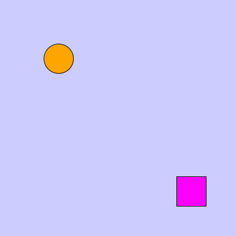
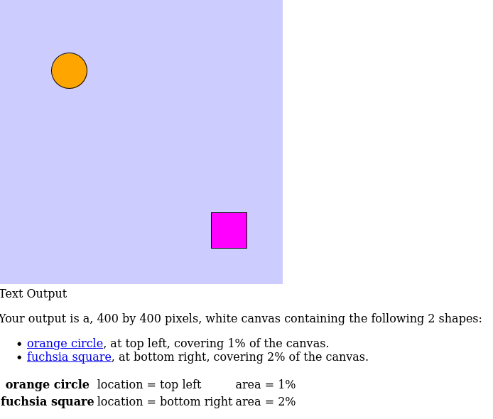
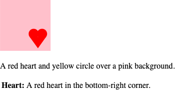

# p5.js Web Accessibility

This document describes the structure of p5.js’ web accessibility features for contributors. 

If you want to make your sketches [screen reader](https://en.wikipedia.org/wiki/Screen_reader)-accessible, visit the How to label your p5.js code tutorial.

If you want to use p5.js with a screen reader, visit the [Using p5.js with a Screen Reader tutorial](https://p5js.org/learn/p5-screen-reader.html).

The canvas HTML element is a grid of pixels. It doesn’t provide any screen reader-accessible information about the shapes drawn on it. p5.js has several functions that make the canvas more accessible to screen readers by providing [fallback text](https://developer.mozilla.org/en-US/docs/Web/API/Canvas_API/Tutorial/Basic_usage#accessible_content) descriptions. I’ll describe some of the details around the implementation of these functions.


## Prerequisites

- p5.js foundation
- Contributor guidelines with local development setup
- Looking inside p5.js
- How to label your p5.js code


## Library-generated accessible outputs for basic shapes

p5.js supports library-generated screen reader-accessible outputs for basic shapes on the canvas with `textOutput()` and `gridOutput()`. It also supports user-generated screen reader-accessible descriptions of the canvas with `describe()` and `describeElement()`. All descriptions are inserted as child elements to the `<canvas>` element.

We’ll look at how the library-generated outputs work first. The following code snippet will serve as an example.

```js
function setup() {
  createCanvas(400, 400);
}

function draw() {
  background("#ccccff");
  textOutput();
  fill("orange");
  ellipse(100, 100, 50);
  fill("fuchsia");
  rect(300, 300, 50, 50);
}
```



`textOutput()` creates a screen reader-accessible output that describes the shapes present on the canvas. The general description of the canvas includes the canvas size, canvas color, and number of elements in the canvas:

> Your output is a, 400 by 400 pixels, lavender blue canvas containing the following 2 shapes:

This description is followed by a list of shapes where the color, position, and area of each shape are described: 

> orange circle at top left covering 1% of the canvas.\
> fuchsia square, at bottom right, covering 2% of the canvas.

Each element can be selected to get more details. A table of elements is also provided. In this table, each element’s  shape, color, location, coordinates, and area are described:

> orange circle location=top left area=1%\
> fuchsia square    location = bottom right    area = 2%

<details>
<summary>This generates the following HTML:</summary>

```html
<canvas id="defaultCanvas0" class="p5Canvas" style="width: 400px; height: 400px;" width="400" height="400">
  <div id="defaultCanvas0accessibleOutput" role="region" aria-label="Canvas Outputs">
    <div id="defaultCanvas0textOutput">
      Text Output
      <div id="defaultCanvas0textOutputSummary" aria-label="text output summary">
        <p id="defaultCanvas0textOutput_summary">
          Your output is a, 400 by 400 pixels, white canvas containing the following 2 shapes:
        </p>
        <ul id="defaultCanvas0textOutput_list">
          <li>
            <a href="#defaultCanvas0textOutputshape0">orange circle</a>, at top left, covering 1% of the canvas.
          </li>
          <li>
            <a href="#defaultCanvas0textOutputshape1">fuchsia square</a>, at bottom right, covering 2% of the canvas.
          </li>
        </ul>
      </div>
      <table id="defaultCanvas0textOutput_shapeDetails" summary="text output shape details">
        <tbody>
          <tr id="defaultCanvas0textOutputshape0">
            <th>orange circle</th>
            <td>location = top left</td>
            <td> area = 1%</td>
          </tr>
          <tr id="defaultCanvas0textOutputshape1">
            <th>fuchsia square</th>
            <td>location = bottom right</td>
            <td> area = 2%</td>
          </tr>
        </tbody>
      </table>
    </div>
  </div>
</canvas>
```

</details>

`gridOutput()` lays out the content of the canvas in the form of a grid using an HTML table element. Each shape’s location in the grid is based on its spatial location on the canvas. A brief description of the canvas is available before the table output. This description includes the color of the background, size of the canvas, number of objects, and object types:

> lavender blue canvas, 400 by 400 pixels, contains 2 shapes:  1 circle 1 square

Each shape’s description is placed in a cell of the table depending on its location on the canvas. Each description includes the color and type of shape:

> orange circle\
> fuchsia square

These descriptions can be selected individually to get more details. A list of elements where shape, color, location, and area are described is also available:

- *orange circle, location = top left, area = 1 %*
- *fuchsia square, location = bottom right, area = 2 %*

<details>
<summary>
The generated HTML is as follows:
</summary>

```html
<canvas id="defaultCanvas0" class="p5Canvas" style="width: 400px; height: 400px;" width="400" height="400">
  <div id="defaultCanvas0accessibleOutput" role="region" aria-label="Canvas Outputs">
    <div id="defaultCanvas0gridOutput">
      Grid Output
      <p id="defaultCanvas0gridOutput_summary" aria-label="grid output summary">
     white canvas, 400 by 400 pixels, contains 2 shapes:  1 circle 1 square
   </p>
      <table id="defaultCanvas0gridOutput_map" summary="grid output content">
        <tbody>
          <tr></tr>
          <tr></tr>
          <tr>
            <td><a href="#defaultCanvas0gridOutputshape0">orange circle</a></td>
          </tr>
          <tr></tr>
          <tr></tr>
          <tr></tr>
          <tr></tr>
          <tr></tr>
          <tr>
            <td><a href="#defaultCanvas0gridOutputshape1">fuchsia square</a></td>
          </tr>
          <tr></tr>
        </tbody>
      </table>
      <ul id="defaultCanvas0gridOutput_shapeDetails" aria-label="grid output shape details">
        <li id="defaultCanvas0gridOutputshape0">orange circle, location = top left, area = 1 %</li>
        <li id="defaultCanvas0gridOutputshape1">fuchsia square, location = bottom right, area = 2 %</li>
      </ul>
    </div>
  </div>
</canvas>
```

</details>

If a user passes `LABEL` as an argument to either of these functions, an additional `<div>` element is created next to the `<canvas>` element. The new \<div> contains a visible version of the same screen reader-accessible description embedded in the `<canvas>` element. This is useful for non-screen reader users who might want to display the output as they code. However, using `LABEL` will create unnecessary redundancy for screen reader users. We recommend using `LABEL` only as part of the development process of a sketch and removing it before publishing or sharing your sketch with screen reader users.




### Outputs structure

Although `textOutput()` and `gridOutput()` are located in [src/accessibility/outputs.js](https://github.com/processing/p5.js/blob/main/src/accessibility/outputs.js), the outputs are created and updated using functions distributed across the library. This section details the different functions that support the accessible outputs.


#### outputs.js

[src/accessibility/outputs.js](https://github.com/processing/p5.js/blob/main/src/accessibility/outputs.js) includes two public methods:

- `textOutput()`
- `gridOutput()`

Both methods activate the accessible output by setting `this._accessibleOutputs.text` or `this._accessibleOutputs.grid `to `true` and calling `this._createOutput('textOutput', 'Fallback')` or `this._createOutput('gridOutput', 'Fallback')` respectively. 

If `LABEL` is passed as a parameter to the method, it also activates the visible text output label by setting `this._accessibleOutputs.textLabel` as `true` and calls `this._createOutput('textOutput', 'Label')` or `this._createOutput('gridOutput', 'Label')`.

In the same file, there are the following private methods as well:

- `_createOutput()`: This method creates the HTML structure for all accessible outputs. Depending on the type and display of the outputs, the HTML structure created will vary. The function also initializes `this.ingredients` which stores all the data for the outputs including: `shapes`, `colors`, and `pShapes` (which stores a string of the previous shapes of the canvas). It also creates `this.dummyDOM` if it doesn't exist. `this.dummyDOM` stores the HTMLCollection of DOM elements inside of `<body>`.
- `_updateAccsOutput()`: Is called at the end of `setup()` and `draw()` if using accessibleOutputs. If `this.ingredients` differs from the current outputs, this function calls the update methods of the accessible outputs (eg. `_updateTextOutput` and `_updateGridOutput`). Calling this function only at the end of `setup()` and `draw()` as well as only calling `_updateGridOutput` and `_updateTextOutput` only when the ingredients are different helps avoid overwhelming the screen reader. Otherwise, a screen reader user would not be able to access the descriptions of the canvas as the content of the divs will be constantly updating.
- `_addAccsOutput()`: This method initializes `this._accessibleOutputs` and returns true when `this._accessibleOutputs.grid` or `this._accessibleOutputs.text` is true.
- `_accsBackground()`: Is called at the end of `background()`. It resets `this.ingredients.shapes` and if the color of the background is different than before it calls `this._rgbColorName()` to get the name of the color and store it in `this.ingredients.colors.background`
- `_accsCanvasColors()`: Is called at the end of fill() and stroke(). This function updates the fill and stroke colors by saving them in `this.ingredients.colors.fill` and `this.ingredients.colors.stroke`. It also calls `this._rgbColorName()` to get the names of the colors.
- `_accsOutput()`: Builds `this.ingredients.shapes` which includes all the shapes that are used for creating the outputs. This function is called at the end of the basic shape functions (see accessible output beyond src/accessibility). Depending on the shape that calls it, `_accsOutput()` may call helper functions to gather all the information about that shape that will be needed to create the outputs. These functions include:
  - `_getMiddle()`: Returns the middle point or centroid of rectangles, arcs, ellipses, triangles, and quadrilaterals.
  - `_getPos()`: Returns the position of a shape on the canvas (e.g.: 'top left', 'mid right').
  - `_canvasLocator()`: Returns location of the shape on a 10\*10 grid mapped to the canvas.
  - `_getArea()`: Returns the area of the shape as a percentage of the canvas' total area.

When `this._accessibleOutputs.text` or `this._accessibleOutputs.text` are `true` several functions across the p5.js library call functions in output.js:

- `_accsOutput()` is called in:
  - `p5.prototype.triangle()`
  - `p5.prototype._renderRect()`
  - `p5.prototype.quad()`
  - `p5.prototype.point()`
  - `p5.prototype.line()`
  - `p5.prototype._renderEllipse()`
  - `p5.prototype.arc()`
- `_updateAccsOutput()` is called in:
  - `p5.prototype.redraw()`
  - `p5.prototype.resizeCanvas()`
  - `this._setup`
- `_accsCanvasColors()` is called in:
  - `p5.Renderer2D.prototype.stroke()`
  - `p5.Renderer2D.prototype.fill()`
- `_accsBackground()` is called in:
  - `p5.Renderer2D.prototype.background()`


#### textOutput.js

[src/accessibility/textOutput.js](https://github.com/processing/p5.js/blob/main/src/accessibility/textOutput.js) contains all the methods that update the text output. The main method in this file is `_updateTextOutput()` which is called by `_updateAccsOutput()` in [src/accessibility/outputs.js](https://github.com/processing/p5.js/blob/main/src/accessibility/outputs.js) when `this._accessibleOutputs.text` or `this._accessibleOutputs.textLabel` are `true.`

`_updateTextOutput()` uses `this.ingredients` to build the content of the text output and text output label which include a summary, a list of shapes, and a table of shapes details. If these are different from the current outputs it updates them. Building the output content is supported by several helper functions in the file that are not part of the `p5` prototype:

- `_textSummary()`: Builds the content of the text output summary.
- `_shapeDetails()`: Builds the text output table that contains shape details.
- `_shapeList()`: Builds the list of shapes of the text output.


#### gridOutput.js

[src/accessibility/gridOutput.js](https://github.com/processing/p5.js/blob/main/src/accessibility/gridOutput.js) contains all methods that update the grid output. The main method in this file is `_updateGridOutput()`, which is called by `_updateAccsOutput()` in [src/accessibility/outputs.js](https://github.com/processing/p5.js/blob/main/src/accessibility/outputs.js) when `this._accessibleOutputs.grid` or `this._accessibleOutputs.gridLabel` are `true.`

`_updateGridOutput()` uses `this.ingredients` to build the content of the grid output and grid output label, which include a summary, a grid that maps the location of shapes, and a list of shapes. If these are different from the current outputs, it updates them. Building the output content is supported by several helper functions in the file that are not part of the `p5` prototype:

- `_gridSummary()`: Builds the content of the grid output summary.
- `_gridMap()`: Builds a grid that maps the location of shapes on the canvas.
- `_gridShapeDetails()`: Builds the list of shapes of the grid output, each line of the list includes details about the shape.


#### color\_namer.js

When creating screen reader-accessible outputs, naming the colors used in the canvas is important. [src/accessibility/color\_namer.js](https://github.com/processing/p5.js/blob/main/src/accessibility/color_namer.js) contains `_rgbColorName()` a method that receives RGBA values and returns a color name. This function is called by `_accsBackground()` and `_accsCanvasColors` in [src/accessibility/outputs.js](https://github.com/processing/p5.js/blob/main/src/accessibility/outputs.js).

`_rgbColorName()` uses `p5.color_conversion._rgbaToHSBA()` to get the HSV values of the color and then uses `_calculateColor()` to get the color name. The function `_calculateColor()` in this file comes from [colorNamer.js](https://github.com/MathuraMG/color-namer), which was developed as part of a [2018 Processing Foundation fellowship](https://medium.com/processing-foundation/making-p5-js-accessible-e2ce366e05a0) and in consultation with blind screen reader expert users. This function returns color names by comparing HSV values to those stored in the `colorLookUp` array, returning the closest color name as a string.


## User-generated accessible canvas descriptions

### describe()

The `describe()` function creates a sketch author-defined screen reader accessible description for the canvas. The first parameter should be a string with a description of the canvas. The second parameter is optional. If specified, it determines how the description is displayed. If a user passes `LABEL` as a second parameter, an additional `<div>` element is created next to the `<canvas>` element. The new `<div>` element contains a visible version of the same screen reader-accessible description embedded in the `<canvas>` element.

`describe()` is supported by several methods in [src/accessibility/describe.js](https://github.com/processing/p5.js/blob/main/src/accessibility/describe.js):

- `_descriptionText()`: Checks that text is not `LABEL` or `FALLBACK` and ensures text ends with a punctuation mark. If the text does not end with '.', ',', ';', '?', '!', this function adds a '.' at the end of the string to improve screen reader readability. This function then returns the text as a string.
- `_describeHTML()`: Creates fallback HTML structure for the canvas. If the second parameter of `describe()` is `LABEL`, this function creates a `<div>` tag adjacent to the `<canvas>` element for the description text.

With example code:

```js
function setup() {
  background('pink');

  fill('red');
  noStroke();
  circle(67, 67, 20);
  circle(83, 67, 20);
  triangle(91, 73, 75, 95, 59, 73);

  describe('A pink square with a red heart in the bottom-right corner.', LABEL);
}
```

The page will output:


### describeElement()

The `describeElement()` function creates a screen reader-accessible description for groups of shapes that create meaning together. For example, a custom-drawn “heart” shape made out of multiple lines of code. The first parameter should be a string with the name of the element, for example, “Heart”. The second parameter should be a string with the description of the element, for example, “A red heart in the bottom-right corner.” The third parameter is optional. If a user passes `LABEL` as a third parameter, an additional `<div>` element is inserted next to the `<canvas>` element. The new \<div> will contain a visible version of the same  description embedded in the `<canvas>` element.

`describeElement()` is supported by several functions in [src/accessibility/describe.js](https://github.com/processing/p5.js/blob/main/src/accessibility/describe.js):

- `_elementName()`: First checks that the element name is not `LABEL` or `FALLBACK` and ensures the name ends with a colon character ‘:’. It then returns the name as a string.
- `_descriptionText()`: Checks that text is not `LABEL` or `FALLBACK` and ensures the text ends with a punctuation mark. If the text does not end with '.', ',', ';', '?', '!', this function adds a '.' at the end of the string. It then returns the text as a string.
- `_describeElementHTML()`: Creates fallback HTML structure for the canvas. When the second parameter of `describeElement()` is `LABEL`, this function creates a div adjacent to the canvas element for the descriptions.

With example code:

```js
function setup() {
  background('pink');
  noStroke();

  describeElement('Heart', 'A red heart in the bottom-right corner.', LABEL);
  fill('red');
  circle(66.6, 66.6, 20);
  circle(83.2, 66.6, 20);
  triangle(91.2, 72.6, 75, 95, 58.6, 72.6);

  describe('A red heart and yellow circle over a pink background.', LABEL);
}
```

The page will output:



